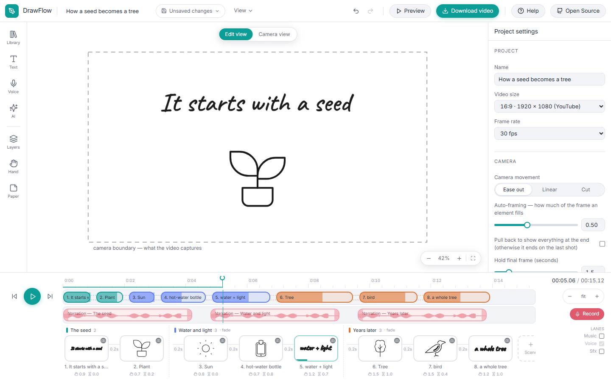
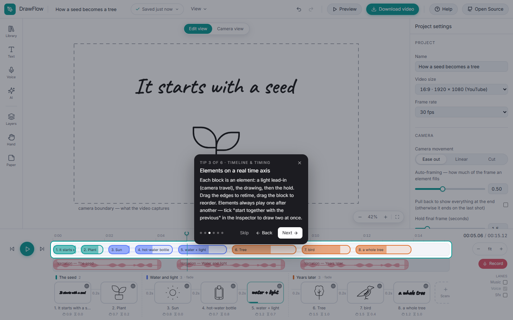

<div align="center">

# DrawFlow

**Whiteboard animation studio — open source, runs on your machine.**

A photographed hand draws pictures and handwriting on a board while a narrator
speaks and the camera glides from shot to shot. Add text, 5,000+ pictures and
people, your own artwork, music, a recorded or AI voice — and download an
MP4, WebM or GIF without anything leaving your computer.


</div>


## Highlights

- **Real whiteboard drawing** — SVG artwork is drawn stroke by stroke by a
  photographed marker, pen or chalk hand (right- or left-handed, or your own
  photo); text is written letter by letter in handwriting fonts; photos are
  revealed with a scribble, wipe or radial reveal.
- **5,000+ open-licensed pictures** — line icons (Tabler, Health Icons), flat
  scenes (Flowbite, illlustrations.co), hand-drawn cartoons (Mega Doodles),
  sketchy people (Open Doodles, Open Peeps) and OpenMoji glyphs in black or
  colour — one search that understands synonyms, plurals and typos.
- **A real timeline** — element track, three audio lanes, markers, snapping,
  scenes with transitions, and a film-strip storyboard.
- **Camera** — an infinite paper and a 16:9 / 9:16 / 1:1 camera that glides
  from shot to shot; per-element framing; ease-out, linear or cut moves.
- **Voice** — record while the scribe plays, upload, or AI narration; *fit to
  narration* retimes the drawing to the phrases of the voiceover.
- **AI, bring your own key** — Anthropic, OpenAI, Groq or Gemini: describe a
  scene and get pictures, write a script and get whole narrated scenes, turn a
  photo into a doodle (offline) or a cartoon. Keys stay in your browser.
- **Export on your machine** — MP4 (H.264), WebM (VP9), GIF, PNG frames, up to
  4K, through the browser's hardware encoders running in parallel; a CLI
  renders `.drawflow.json` files headlessly.
- **Projects that save themselves** — autosave with thumbnails, version
  history, eight starter templates, portable single-file projects with a JSON
  Schema.
- **Built-in help** — guided tours for every feature and every shortcut,
  anchored to the real controls.
- **Windows app** — the same editor in Electron, with an installer.

## Screenshots

| Camera view — what the video shows | Script → narrated scenes (AI) |
| --- | --- |
|  |  |

| Library search | People |
| --- | --- |
|  |  |

| Export | Guided help |
| --- | --- |
|  |  |


## Run it

```bash
git clone https://github.com/Zahoor-ishfaq/drawflow.git
cd drawflow
npm install
npm run dev              # editor at http://localhost:5173
```

```bash
npm run build            # production build in dist/
npm run preview          # serve the build
npm run desktop:pack     # Windows installer (Electron) in release/
npm test                 # end-to-end tests (uses the Chrome/Edge on your machine)
npm run library:build    # rebuild the picture library from its sources
```

Requirements: Node 20+, and a recent Chrome or Edge for fast export (other
browsers fall back to a software encoder).

## Documentation

- **[User guide](docs/user-guide.md)** — every feature, step by step, with
  screenshots. Or press **Help** in the app for guided tours.
- [Command line](docs/cli.md) — render, validate and preview projects headlessly.
- [Scripting API](docs/api.md) — `window.DrawFlow` for automation and tests.
- [Plugins](docs/plugins.md) — add effects, asset providers, exporters and panels.
- [Project format](docs/project-format.md) and the
  [JSON Schema](schema/drawflow.schema.json).
- [Architecture](docs/architecture.md) — how rendering, timing and export work.
- [Feature checklist](checklist.md) — what is done, what is not.

## Command line

```bash
npm run build
npx drawflow render examples/explainer.drawflow.json            # → explainer.mp4
npx drawflow render *.drawflow.json --format webm --height 720 -o out/
npx drawflow render talk.drawflow.json --scene "The result"
npx drawflow validate my.drawflow.json
npx drawflow preview my.drawflow.json
```

The CLI serves the built app and drives headless Chrome/Edge through the same
`window.DrawFlow` API the editor uses, so it renders exactly what the Export
button renders.

## Privacy

There is no server and no account. Projects, uploads and settings live in
your browser (or in files you save); rendering and every offline feature run
locally. The only network calls are the ones you enable by entering an AI key,
and they go straight from your browser to that provider. Keys are stored in
this browser only — never in project files, exports or this repository.

## Shortcuts

Press `?` in the app for the full sheet. The essentials: `Space` play/pause ·
`Ctrl+Z`/`Ctrl+Shift+Z` undo/redo · `Ctrl+C/X/V` · `Ctrl+D` duplicate · `Ctrl+A`
select all · arrows nudge · `Ctrl+G` group · `[`/`]` stacking · `M` marker ·
`S` split clip · `F` frame selection · `Shift+F` full-screen preview ·
`Ctrl+K` command palette · `Ctrl+O` projects · `Ctrl+E` export.

## Contributing & contact

Issues and pull requests are welcome at
[github.com/Zahoor-ishfaq/drawflow](https://github.com/Zahoor-ishfaq/drawflow).
Questions: [open an issue](https://github.com/Zahoor-ishfaq/drawflow/issues)
or email zahoor.ishfaaq@gmail.com.

## Credits

Made by **Zahoor Ishfaq**. Built with the help of Claude (Anthropic).

Artwork, hands and fonts are open-licensed — every source and licence is
listed in [CREDITS.md](CREDITS.md): OpenMoji, Open Doodles, Open Peeps, Tabler
Icons, Health Icons, Flowbite Illustrations, illlustrations.co, Mega Doodles,
Unsplash photographs, Google Fonts.

## License

[MIT](LICENSE)
