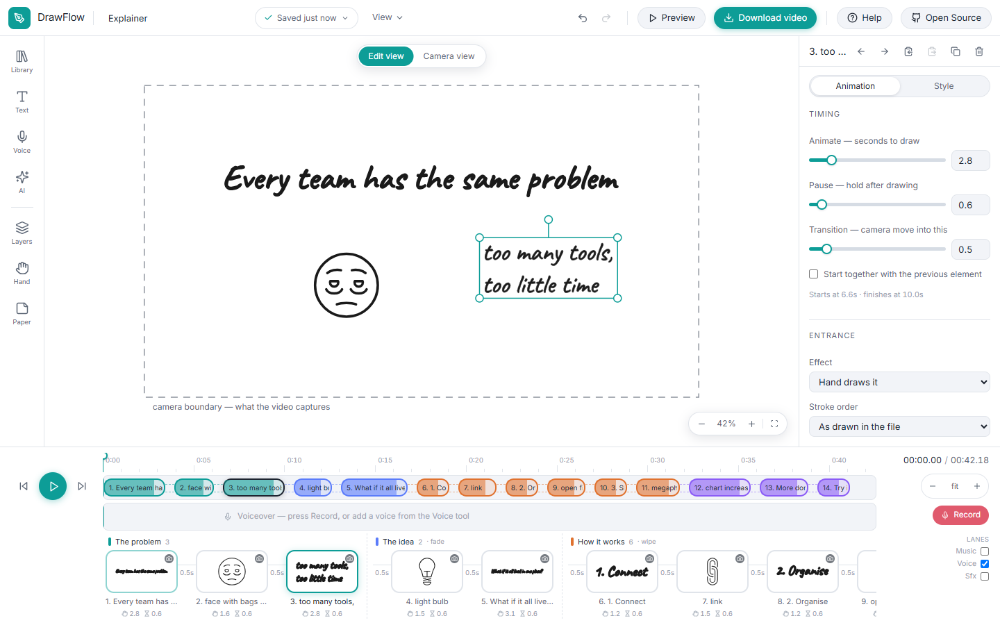
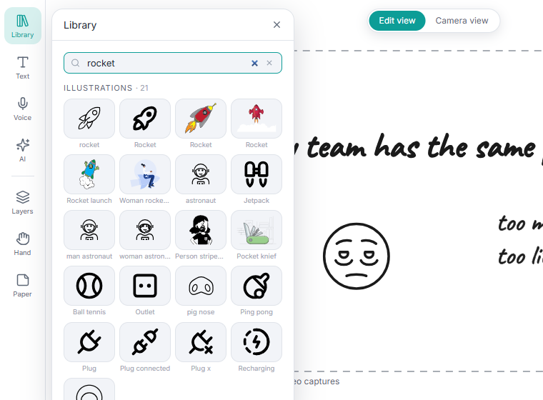
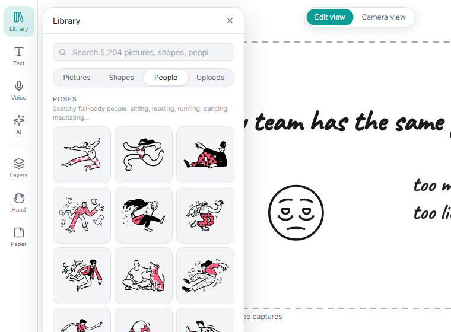
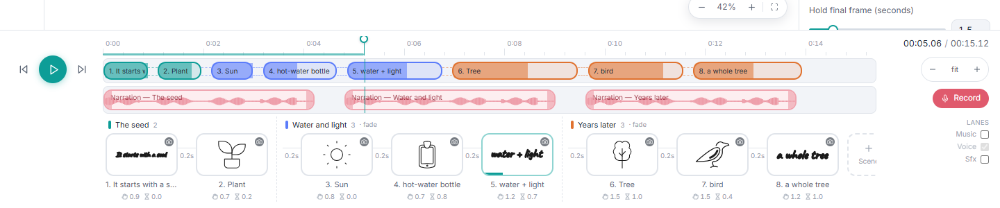
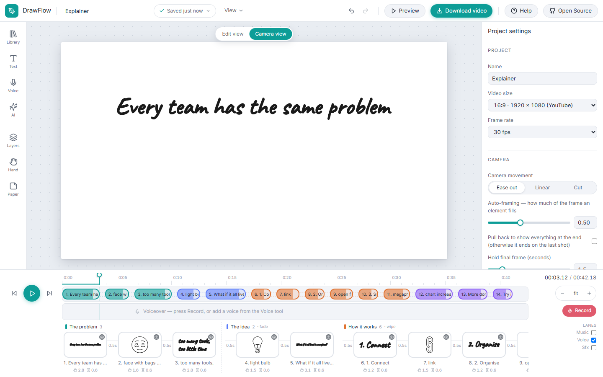
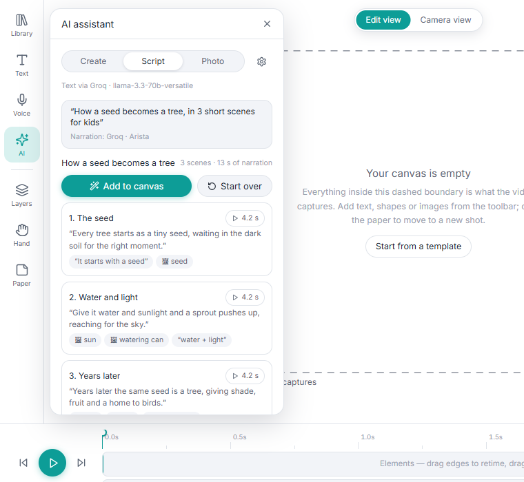
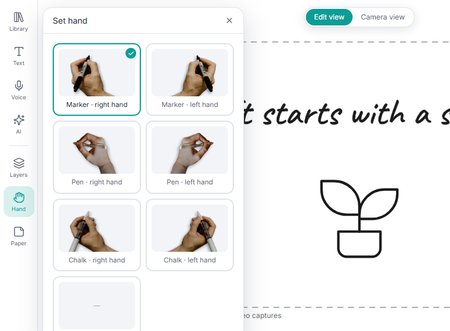
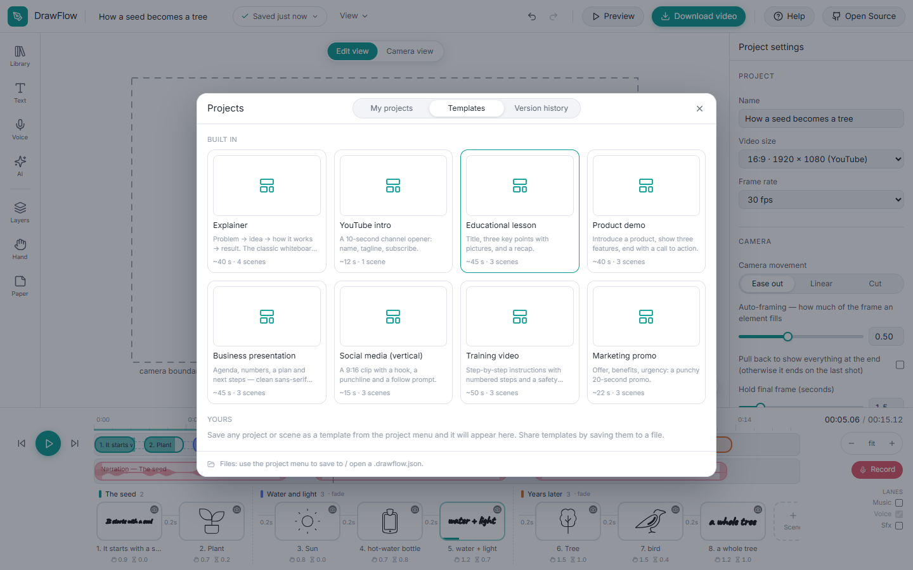
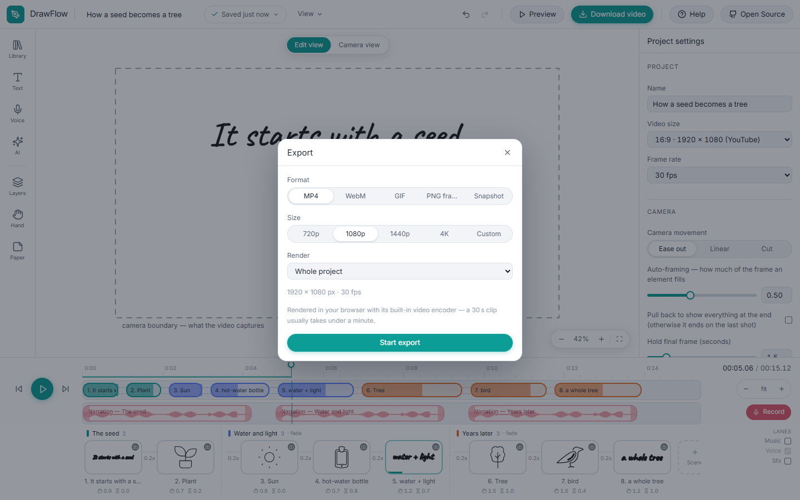

# DrawFlow user guide

DrawFlow makes whiteboard-animation videos: a photographed hand draws pictures
and handwriting on a board while a narrator speaks, and the camera glides from
shot to shot. Everything runs on your own machine — in the browser or as a
Windows app — and nothing you make is uploaded anywhere.

This guide walks through the whole app. If you prefer learning inside the app,
press **Help** (top right) and pick a feature: a guided tour points at the real
controls, one tip at a time.

- [1. Install and run](#1-install-and-run)
- [2. The screen](#2-the-screen)
- [3. Your first video in five minutes](#3-your-first-video-in-five-minutes)
- [4. Adding things to the board](#4-adding-things-to-the-board)
- [5. Arranging things on the paper](#5-arranging-things-on-the-paper)
- [6. How each element animates](#6-how-each-element-animates)
- [7. The timeline](#7-the-timeline)
- [8. Scenes](#8-scenes)
- [9. The camera](#9-the-camera)
- [10. Voice, music and sound effects](#10-voice-music-and-sound-effects)
- [11. The AI assistant](#11-the-ai-assistant)
- [12. Hands and paper](#12-hands-and-paper)
- [13. Layers, locking, hiding, grouping](#13-layers-locking-hiding-grouping)
- [14. Projects, templates and version history](#14-projects-templates-and-version-history)
- [15. Downloading the video](#15-downloading-the-video)
- [16. Keyboard shortcuts](#16-keyboard-shortcuts)
- [17. Privacy: what leaves your computer](#17-privacy-what-leaves-your-computer)
- [18. Troubleshooting](#18-troubleshooting)

---

## 1. Install and run

**In the browser (development / from source)**

```bash
git clone https://github.com/Zahoor-ishfaq/drawflow.git
cd drawflow
npm install
npm run dev          # open http://localhost:5173
```

**As a Windows app (no build needed)**

Download `DrawFlow-Setup-x.y.z.exe` (installer) or `DrawFlow-x.y.z-portable.exe`
(single file, no installation) from the
[Releases page](https://github.com/Zahoor-ishfaq/drawflow/releases/latest).
The app is the same editor inside its own window, works offline and needs no
browser. Windows SmartScreen may warn about an unsigned app the first time —
*More info → Run anyway*. To build it yourself: `npm run desktop:pack`
(installer and portable exe land in `release/`).

**Requirements.** A recent Chrome or Edge (the editor uses the browser's own
video encoders — WebCodecs — for fast export; other browsers fall back to a
slower software encoder). A microphone if you want to record narration.

---

## 2. The screen



| Area | What it is for |
| --- | --- |
| **Top bar** | Project name, project menu (new / open / save / templates / versions), View menu (grid, rulers, guides, theme, panels), undo / redo, **Preview**, **Download video**, **Help**, **Open Source**. |
| **Left rail** | Tools that add things — *Library*, *Text*, *Voice*, *AI* — and tools that set things up — *Layers*, *Hand*, *Paper*. Each opens a panel next to the rail. |
| **Canvas** | An infinite sheet of paper. The dashed rectangle is the **camera boundary**: what the video captures right now. *Edit view* shows the paper; *Camera view* shows exactly what the video shows at the current time. |
| **Inspector (right)** | With nothing selected: project settings (size, frame rate, camera behaviour, end hold). With an element selected: its timing, entrance, emphasis, exit, camera framing and style. With a clip selected: volume, fades, split, clean-up. |
| **Timeline (bottom)** | Transport, a time ruler with markers, the element track, the audio lanes and, underneath, the **film strip** — one card per element, grouped by scene. |

---

## 3. Your first video in five minutes

1. Click **Library**, type `light bulb`, click the picture. It lands inside the
   camera boundary.
2. Click **Text**, type *A bright idea*, press **Add**. The text is real
   handwriting — it will be written letter by letter.
3. Drag the two things where you want them. Pull a corner handle to resize.
4. Press **Preview** (or `Space`). The hand draws the bulb, then writes the
   text, and the camera frames them.
5. Click the bulb: in the Inspector set *Animate* to 2 s and *Pause* to 1 s.
   Every element has these three numbers: **Transition** (camera travel into
   it), **Animate** (drawing time) and **Pause** (hold afterwards).
6. Click **Voice → Record**: the scribe plays from the playhead while your
   microphone is recorded onto the Voice lane. Or type a sentence for an AI
   voice.
7. **Download video** → MP4 1080p → Export. The file is rendered on your
   machine and saved by the browser.

Projects save themselves in the browser a moment after every change. `Ctrl+O`
lists them, with thumbnails, alongside the starter templates.

---

## 4. Adding things to the board

### The Library



One search box covers 5,000+ pictures, the shapes and icons, the people and
your own uploads. It understands plurals, synonyms and typos: *bulb* finds
light bulbs, *rocet* finds rockets, *teacher* finds people at a blackboard.
Results are grouped — *Your uploads*, *Illustrations*, *Shapes & icons*.

Below the search, four tabs:

- **Pictures** — browse by category. *Illustrations* are detailed flat scenes
  (people working, shopping, brainstorming, charts…); *Cartoons* are
  hand-drawn characters and speech bubbles; the other categories (Objects,
  Business & Finance, Technology, Education & Science, Animals & Nature, Food &
  Drink, Travel & Places, Activities, Health & Safety, Symbols & Arrows) are
  clean line drawings the hand draws stroke by stroke. Tick **Colour versions
  where available** to show and add the coloured twins of the glyphs. Star a
  picture to collect it under **★ Favourites**; **Recent** remembers what you
  used.
- **Shapes** — rectangles, circles, arrows, stars, callouts and a few hundred
  outline icons.
- **People** — poses (sketchy full-body people: sitting, reading, running,
  dancing, standing, walking…), expressions, gestures and roles.

  
- **Uploads** — your own artwork. Drop SVG, PNG or JPG files here or straight
  onto the board. SVGs are drawn as vector strokes; photos are revealed with a
  scribble, a wipe or a radial reveal (choose under *Entrance*). Uploads are
  kept in the browser, can be renamed and tagged, and can be exported /
  imported as a pack.

Where it comes from and the licences: [CREDITS.md](../CREDITS.md). Everything
bundled may be used in commercial videos; OpenMoji and Mega Doodles artwork
keeps its CC BY-SA licence.

### Text

The **Text** tool writes real handwriting: the text is converted to glyph
outlines so the hand traces every letter. Choose the font (Caveat, Shadows Into
Light, a clean sans, or your own TTF/OTF under *Fonts*), size, bold / italic,
alignment, line height, letter spacing and right-to-left. With a text element
selected, the Inspector's *Style* tab edits the same things, and *Typewriter*
under Entrance shows the words one at a time instead of drawing them.

### Pictures from the AI

The **AI** tab can suggest library pictures and drawings from a description,
generate a picture with an image model, turn a photo into a doodle (offline)
or a cartoon, and build whole narrated scenes from a script — see
[section 11](#11-the-ai-assistant).

---

## 5. Arranging things on the paper

- **Move** — drag an element. **Resize** — drag a corner handle (the size is
  a scale, so nothing gets blurry). **Rotate** — drag the handle above it, hold
  `Shift` for 15° steps.
- **Pan** — drag empty paper (the cursor becomes a hand) or middle-drag.
  **Zoom** — wheel, `Ctrl+=` / `Ctrl+-`; `Ctrl+0` fits everything, `Ctrl+1` is
  100 %, `F` frames the selection.
- **Select several** — `Shift`-click, `Shift`-drag a marquee on empty paper,
  `Ctrl+A`. The Inspector then offers align (left / centre / right / top /
  middle / bottom), distribute, group (`Ctrl+G`, merges vector elements into
  one) and *draw together*.
- **Snapping** — smart guides pull edges and centres onto other elements and
  the video frame while you drag; *View → Snap to grid* (`Ctrl+'`) adds a grid;
  `Ctrl+R` shows rulers.
- **Copy / paste / duplicate** — `Ctrl+C/X/V`, `Ctrl+D`; pasting repeatedly
  offsets each copy. Arrow keys nudge by 1 px, `Shift+arrows` by 10 px.
- **Style** tab — stroke colour and width, fill colour, fill after drawing,
  opacity, flip, crop and *Replace image* for photos (keeps timing and
  position).

---

## 6. How each element animates

Select an element and open the Inspector's **Animation** tab.

**Timing**

| Field | Meaning |
| --- | --- |
| Transition | Seconds of camera travel before this element (0 when it shares the previous shot). |
| Animate | Seconds the hand spends drawing / revealing it. |
| Pause | Seconds it holds afterwards before the next element starts. |
| Start together with the previous element | Draws at the same time as the element before it (for labels next to pictures, for example). |

Elements always play one after another, in the order of the film strip; the
timeline's start times are derived from these numbers, so nothing can ever
overlap by accident.

**Entrance** — *Hand draws it* (default), *Appear*, *Fade*, *Slide* from any
side, *Wipe*, *Scale*, *Pop*, *Bounce*, *Typewriter* (text). Vector art has a
**stroke order** (as in the file, reversed, left→right, right→left,
top→bottom, bottom→top, centre out); photos have a **reveal** (scribble, wipe,
radial, centre). *Easing* shapes the motion.

**Emphasis** — after drawing: pulse, shake, bounce, spin, grow or highlight,
with duration, delay and repeat count. The next element waits for it.

**Exit** — fade, slide, wipe, shrink, *erase* (the hand rubs it out) or
*reverse draw* (the hand undraws it), starting a chosen delay after the
element's pause. Later elements keep drawing meanwhile, which is how you clear
part of the board.

**Camera** — where the camera is while this element draws; see
[section 9](#9-the-camera).

**Hand** — this element can use a different hand from the project's.

Right-click an element (or its card in the strip) for *Play from here*,
duplicate, move to scene, lock, hide, delete. `Ctrl+Shift+C` / `Ctrl+Shift+V`
copy and paste the whole animation setup between elements.

---

## 7. The timeline



- **Transport** — play / pause (`Space`), jump to start / end (`Home` /
  `End`), step a frame (`,` / `.`).
- **Ruler** — click to move the playhead; double-click (or press `M`) to drop a
  **marker**: a named point that everything snaps to. Drag markers, right-click
  to rename, recolour or delete.
- **Element track** — one block per element: a light lead-in (the camera
  transition), the drawing, an emphasis stripe if any, then the pause; exits
  show as a tail. Drag the edges to retime, drag the whole block to reorder.
  Blocks are coloured by scene.
- **Audio lanes** — *Music*, *Voice* and *SFX*. Drag a clip to move it (clips
  on a lane never overlap — a dragged clip stops at its neighbour), drag its
  ends to trim, press `S` to split it at the playhead. Drop an audio file onto
  a lane to import it there. A lane appears when it has clips, or tick it under
  **Lanes** on the right to show it early.
- **Zoom** — `Ctrl+wheel` over the timeline zooms around the cursor; the ± and
  *fit* buttons on the right do the same. Drag the bar above the timeline to
  make it taller.
- **Film strip** — the storyboard: cards in play order, grouped under scene
  headers. Click a card to jump to it, drag to reorder, double-click to rename,
  right-click for options. The two numbers under each card are Animate and
  Pause.

Snapping applies everywhere on the timeline: to markers, clip edges, other
elements, the playhead and whole seconds.

---

## 8. Scenes

A scene is a stretch of the story with its own transition and, if you like, its
own paper. The **+ Scene** card at the end of the strip adds one; the canvas
glides to fresh paper to the right of everything so far, and the elements you
add next belong to the new scene.

- **Scene header** (in the strip) — click to jump there, double-click to
  rename, right-click for: *Scene settings*, *Select its elements*, *Camera:
  frame whole scene*, *Add scene after*, *Duplicate*, *Move earlier / later*,
  *Delete* (keeping or removing its elements).
- **Scene settings** — transition into the scene (*cut*, *fade*, *wipe*) and its
  length; *clear the board first*; a paper style and colour just for this
  scene.
- Move an element between scenes by dragging its card under another header or
  with *Move to scene* in its right-click menu.
- Export a single scene from the export dialog. Save a scene as a template
  from the project menu.

---

## 9. The camera



The video is one 16:9 (or 9:16, 1:1) window that moves over the infinite
paper. In **Edit view** the dashed **camera boundary** is that window at the
current time. Pan or zoom the canvas and the boundary follows; elements you add
share that shot until you pan away — so you build the video one shot at a
time.

Per element (Inspector → *Camera*):

| Choice | The camera… |
| --- | --- |
| Stay | keeps the previous shot. |
| This shot | moves to a framing recorded for this element. |
| Zoom to it | zooms in on the element itself (tightness adjustable). |
| Scene | frames the whole scene. |
| All | pulls back to show every element. |

**Go to shot** brings the canvas to the element's framing; pan or zoom until
the boundary shows what you want, then **Set from boundary** records it. When
an element's shot differs from the boundary you are looking at, a faint teal
outline on the paper shows where the camera will be while it draws.

Project settings: camera movement (ease out, linear, cut), how much of the
frame an element fills when zooming to it, *pull back to show everything at
the end*, and how long the last frame holds.

**Camera view** (top of the canvas) plays exactly what will be rendered, hand
included — check it before exporting. `Shift+F` opens a full-screen preview.

---

## 10. Voice, music and sound effects

The **Voice** tool has four parts:

1. **Voiceover** — *Record from X s* plays the scribe from the playhead and
   records your microphone onto the Voice lane (anything already there is
   trimmed or split, as in a video editor). Or *upload* a recording, or type
   text for an **AI voice** — OpenAI (`gpt-4o-mini-tts`), Groq (Orpheus:
   Troy, Austin, Daniel, Hannah, Autumn, Diana) or Gemini. Long text is spoken
   in pieces and joined. Each take becomes a clip at the playhead.
2. **Music** — import MP3 / WAV / M4A / OGG; it starts at 0.
3. **Sound effects** — twelve built-in synthesised effects (pop, click,
   whoosh, ding, chime…) with preview; they land at the playhead.
4. **Fit to narration** — retimes every element so each is drawn during a
   phrase of the voiceover: from the pauses it detects (offline) or from a
   transcript with sentence timestamps (Whisper, Groq or OpenAI key). Elements
   draw at their own pace but never past their phrase.

Select a clip for its settings in the Inspector: name, volume (up to 150 %),
fade in / out, mute, solo, normalise (loudest moment to 90 %), *Clean up
background noise* for recordings, split.

---

## 11. The AI assistant



Bring your own key — press the gear in the AI panel. Keys are stored only in
this browser and sent only to the provider you chose; DrawFlow has no server.
Groq and Google Gemini offer free tiers; Anthropic and OpenAI are paid. The
settings dialog starts with **Who does what**: which provider handles text,
which handles pictures, which can speak.

For Groq and Gemini choose the **Plan** your key is on — *Free tier* offers
only the models that have free quota, *Paid* offers everything the key can
reach. Press **Models** after pasting a key: the list is fetched, the best
model for your plan is picked and checked with a one-word request, and if the
provider refuses it the next candidate is tried until one answers ("✓ …
answers with this key").

- **Create** — describe what should be on the board ("a lightbulb with a plant
  growing out of it", "a 3-part scene about saving money"). You get proposals:
  library pictures, text and AI-drawn SVGs, each with an *Add* button. Tick
  *Generate a picture instead* to make a raster picture with the image
  provider (Gemini or OpenAI).
- **Script** — paste a script or a topic. Tick *Add narration* to have an AI
  voice speak every scene. **Generate** plans the scenes, then generates the
  narration audio, showing its progress; the result lists every scene with its
  narration, a play button per take and the pictures it will use. **Add to
  canvas** builds the scenes side by side on the paper, puts the takes on the
  Voice lane and times the drawing to the voice. Undo removes it all.
- **Photo** — drop a photo: *Doodle* traces it into strokes offline (detail and
  line sliders); *Cartoon* redraws it with the image model.

If a request fails, a dialog explains what happened (key rejected, model not
in your plan, rate limit, out of credit, provider down, network blocked…),
what to do, and which setting was involved.

---

## 12. Hands and paper



**Hand** — marker, pen or chalk photographs, each as a right hand (arm from
the right) and a left hand. Upload a transparent PNG / WebP of your own hand
and click where the pen tip is. Project settings add a nudge and motion
smoothing; an element can override the hand.

**Paper** — plain, grid, dots, lined, cream, chalkboard or kraft, any colour
(chalkboard makes the default ink white). Scenes can override the paper.

---

## 13. Layers, locking, hiding, grouping

The **Layers** panel lists every element, top-most first — this is also the
draw order. Drag the grip (or use the arrows) to reorder; `[` / `]` and
`Ctrl+[` / `Ctrl+]` change stacking from the keyboard; a per-element *layer*
offset in the Inspector keeps something on top regardless of draw order.

- **Lock** (`Ctrl+L`) — can't be moved or selected on the canvas.
- **Hide** (`Ctrl+Shift+H`) — takes no time and is left out of the video.
- **Group** (`Ctrl+G`) — merges selected vector elements into one; `Ctrl+Shift+G`
  ungroups.

---

## 14. Projects, templates and version history

- Every project is checkpointed to the browser 1.5 s after each change, with a
  thumbnail. `Ctrl+O` opens **Projects** — open, duplicate, rename, delete —
  and **Templates**.
- **Templates** — eight starters (Explainer, YouTube intro, Educational
  lesson, Product demo, Business presentation, Social media vertical, Training
  video, Marketing promo). *Save as template* keeps your own, for whole
  projects or single scenes.

  
- **Version history** (`Ctrl+S`) — named snapshots you can restore.
- **Files** — *Save as file* writes a portable `.drawflow.json` with
  everything embedded (artwork, audio, fonts). *Open file* validates and
  repairs it. The format is documented in
  [project-format.md](project-format.md) with a JSON Schema.

---

## 15. Downloading the video



**Download video** (`Ctrl+E`):

- **Format** — MP4 (H.264 + AAC), WebM (VP9 + Opus), GIF, PNG frame sequence
  (zip) or a single PNG snapshot of the current frame.
- **Size** — 720p, 1080p, 1440p, 4K or any height; the aspect ratio follows the
  project.
- **Range** — the whole project or one scene.
- Progress shows frames per second and time left; cancel any time.

Rendering uses the browser's hardware encoders (WebCodecs) with several
encoders in parallel; a 30-second 1080p clip takes roughly its own length on a
two-core laptop and less on more cores. Browsers without WebCodecs fall back
to a software encoder (slower). The desktop app renders the same way.

From the command line, `npx drawflow render my.drawflow.json` renders files
headlessly with the same engine — see [cli.md](cli.md).

---

## 16. Keyboard shortcuts

Press `?` in the app for the full sheet, or run *Help → Keyboard shortcuts* for
a tour that shows each group next to the part of the app it belongs to.

| Area | Keys |
| --- | --- |
| Playback | `Space` play / pause · `Home` / `End` · `,` / `.` frame step · `Shift+F` full screen · `M` marker |
| Editing | `Ctrl+Z` / `Ctrl+Shift+Z` undo / redo · `Ctrl+C/X/V` · `Ctrl+D` duplicate · `Ctrl+A` · `Delete` · arrows nudge · `Ctrl+G` group · `Ctrl+L` lock · `Ctrl+Shift+H` hide · `[` `]` stacking · `Ctrl+Shift+C/V` copy / paste animation · `Esc` deselect |
| Canvas | drag paper / middle-drag pan · `Shift+drag` marquee · wheel / `Ctrl+=` / `Ctrl+-` zoom · `Ctrl+0` fit · `Ctrl+1` 100 % · `F` frame selection · `Ctrl+'` grid · `Ctrl+R` rulers |
| Audio | `S` split the selected clip at the playhead |
| App | `Ctrl+K` command palette · `Ctrl+O` projects · `Ctrl+E` export · `Ctrl+S` versions · `?` shortcuts |

The **command palette** (`Ctrl+K`) can run any command by name — add a marker,
fit the view, open a template, switch the theme, start a tour.

---

## 17. Privacy: what leaves your computer

- Projects, uploads, favourites and settings live in your browser's storage
  (IndexedDB / localStorage) or in files you save. There is no account and no
  server.
- Video rendering, photo-to-doodle, silence detection and everything else
  happens locally.
- The only network calls are the ones **you** switch on by entering an AI key:
  they go directly from your browser to that provider (Anthropic, OpenAI, Groq
  or Google) and carry only the request you made. Keys are stored in this
  browser's localStorage under `drawflow.ai`, never in project files,
  templates or exports, and never in this repository. Remove a key in AI
  settings to stop all calls.

---

## 18. Troubleshooting

| Problem | What to check |
| --- | --- |
| **Export fails or is slow** | Use Chrome or Edge (WebCodecs). The fallback encoder needs the page to be cross-origin isolated; the dev server, `npm run preview` and the desktop app send the right headers. |
| **No sound in the preview** | Browsers need a click before they play audio — press Play again. Check the clip is not muted and no other clip is soloed. |
| **Recording does nothing** | Allow the microphone for `localhost` (or the app) in the browser's site settings. |
| **AI request fails** | Read the dialog: it names the cause and the setting involved. Pictures use the *picture* provider, not the text provider. A Gemini model with "limit: 0" is not on the free tier — choose another image model. |
| **"The model sent a broken answer"** | The model replied with text that is not valid JSON; DrawFlow repairs the usual slips and asks the model once to fix its reply, so this now appears only when both fail. Press Generate again, or pick a stronger model (Gemini 2.5 Flash, Llama 3.3 70B, GPT-OSS 120B). |
| **Library search finds nothing** | The index loads on first use; wait a moment. Spelling is forgiving, but try a simpler noun. |
| **Something disappeared** | `Ctrl+Z`. The Layers panel shows hidden elements; version history restores older snapshots. |
| **The app looks wrong after an update** | Reload once; the CSS is rebuilt on the first request after a change. |

Questions, bugs and ideas: [GitHub issues](https://github.com/Zahoor-ishfaq/drawflow/issues)
or zahoor.ishfaaq@gmail.com.
